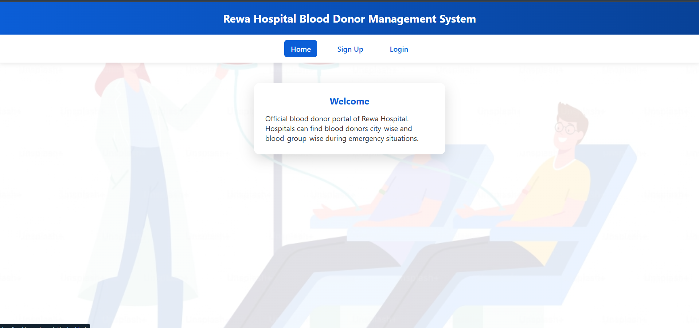
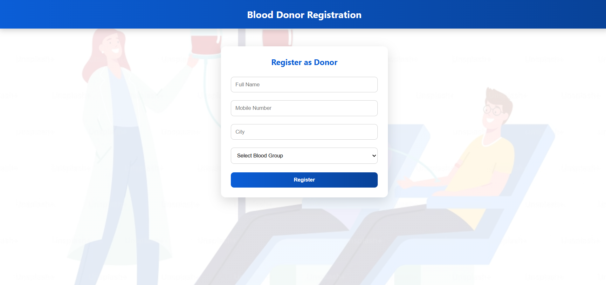
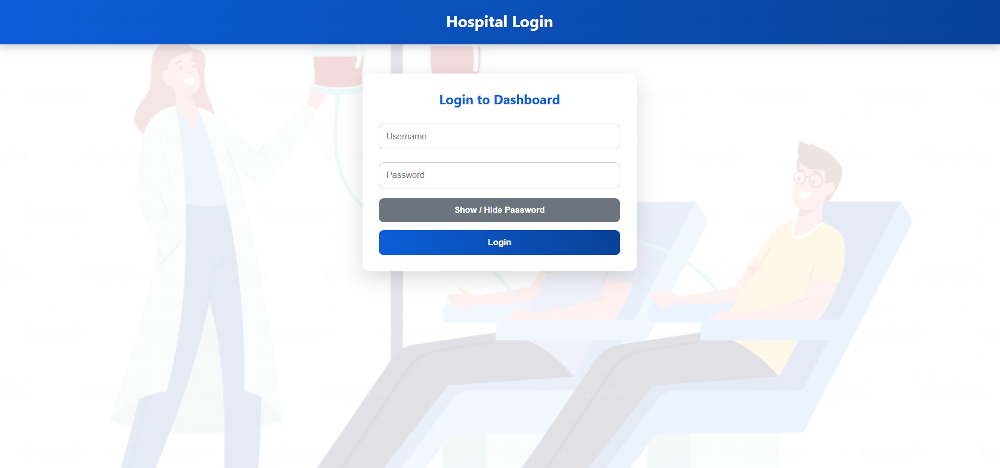
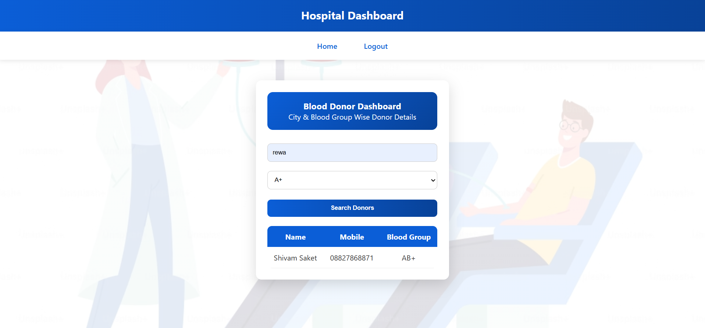

# 🩸 Hospital Blood Donor Management System

A web-based blood donor management system developed to help hospitals quickly find suitable blood donors during emergency situations.  
This project allows hospitals to search donors by **city** and **blood group**, making the process faster and more efficient.

---

## 🔗 Live Demo

🌐 **Live Website:** [View Project](https://rewa-hospital.infinityfreeapp.com)  
💻 **GitHub Repository:** [View Source Code](https://github.com/ShivamSaket-88/hospital-blood-donor-management-system)

---

## 📌 Project Overview

The **Hospital Blood Donor Management System** is designed to simplify donor management for hospitals.  
It provides an easy interface for donor registration and allows hospitals to search available donors based on required details.

This project is useful in emergency cases where hospitals need blood donors quickly and accurately.

---

## ✨ Features

- Donor registration system
- Hospital admin login
- Search donors by city
- Filter donors by blood group
- Clean and simple user interface
- Connected with MySQL database
- Live deployed project

---

## 🛠️ Technologies Used

- **Frontend:** HTML, CSS, JavaScript
- **Backend:** PHP
- **Database:** MySQL
- **Server:** XAMPP / InfinityFree
- **Version Control:** GitHub

---

## Project Structure

rewa_hospital/
│
├── index.html
├── signup.php
├── login.php
├── dashboard.php
├── db.php
├── css/
├── js/
└── images/

## Screenshots

### Home Page

### Donor Registration

### Login Page

### Dashboard

## Author
Shivam Saket  
B.Tech CSE  
Rewa Engineering College
